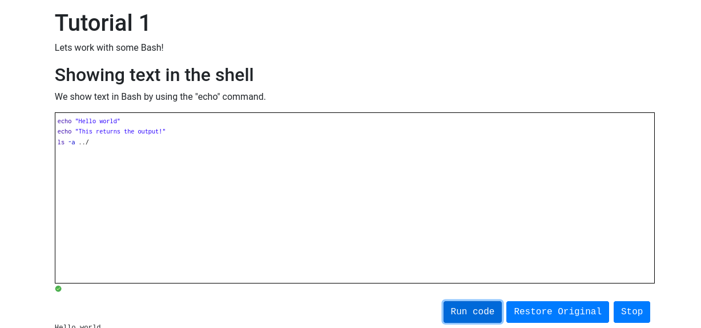

# How code is executed
The application uses the client/server architecture.

## Client Side
On the client side, users interact with code through tutorials. Each tutorial is made up of text and optionally one or more code cells which look like:

Each code cell in a tutorial has three parts associated with it:
1. The name of the language being ran(bash, julia, python, zsh). In the example above, the language is `bash`.
2. A unique name of the interpreter instance used to run the code within the cell. This name could be anything(mix of letters, numbers and symbols) and is used to differentiate code cells that use the same language but need to be ran in separate interpreter instances.
3. The contents of the code cell which should be executed by the interpreter selected.
Example block in markdown(backslash is used just within this markdown document to prevent issues with rendering the content of the code block properly):
```markdown
 \``` python interpreter-name
    print("hello world")
 \```
```

Once the user runs a code block, its contents are sent in a `POST` request to the API endpoint responsible for running running blocks of code(`/run` in our API).


## Server Side
On the server side there are several general steps taken to execute each block of code. These steps are:
1. Retrieve the users id from the session instance created upon login.
2. Retrieve an existing connection to an interpreter or create one if it does not exist.
3. Send code to interpreter.
4. Send response from interpreter to user.

### Managing interpreter instances used to execute code
Each interpreter instance used to execute code is ran within a Docker container instance based off the official `Ubuntu` image. Due to this, each interpreter has access to its own file system and actions from one user(creating/editing/deleting files and folders) will not affect any other users.

Communications between the main backend server responsible for handling requests and each interpreter instance is implemented using a client/server architecture. The client(main application server) creates a new docker instance for a specific language. When the docker instance is created, a port is exposed and a server within the container is listening to it. Once the Docker container instance is initialized, the client(main application) server will connect to the server running within the instance using a socket. Client(main application server) and server running with a Docker instance will then communicate using JSON.

Keeping track of each user and all associated data(what interpreters they have open, name of the interpreter instance, socket...) is done by the `InterpreterManager` class. This class can be viewed as a hash map which looks like:
```javascript
{
    'user1':{
        'interpreter_with_name': SOCKET_CLASS
        'interpreter_with_name_2': SOCKET_CLASS
    },
    'user2':{
        'interpreter_with_name_3': SOCKET_CLASS
        'interpreter_with_name_4': SOCKET_CLASS
    }
    ...
    ...
    ...
}

```


When the main application server receives a request to run a block of code, the users `id` is retrieved from the information stored within the session created upon login. Next, the interpreter language and interpreter name are retrieved from the request. If the currently logged in user does not have an interpreter instance started, the instance is created.

If the current user does have an instance started then the contents of the code block are sent to the interpreter via the socket connection between the main application server and the server running within the docker container. The message sent looks like:
```json
{
    type:"RUN"
    code:CODE_FROM_BLOCK
}
```
Once the interpreter finishes executing the message, there can be two responses which are sent back:
1. No exceptions/errors thrown during execution:
```json
{
  type: 'SUCCESS',
  stdout: OUTPUT_OF_CODE_HERE
  stderr: ''
}
```
2. Exception/errors are thrown during execution
```json
{
  type: 'FAILURE',
  stdout: ''
  stderr: ERROR_MESSAGE_OF_EXCEPTION_HERE
}
```

Any of the two possible responses are then sent back to the front-end and shown to the user. The interpreter instance/docker container keep living until they are stopped by the user or they time out.

### Ending/Killing a running interpreter/docker instance
Users can manually stop an interpreter instance if it is no longer needed or they want to restart it. To kill an interpreter instance, the main application server sends a packet to the specific docker instance/interpreter. This packet contains a JSON object which looks like:
```json
{
    type:"KILL"
}
```
When the interpreter instance receives this packet, it automatically stops executing and terminates itself. The docker container hosting the interpreter instance is then stopped as well.
### Checking if an interpreter/docker instance is running
Currently there is no mechanism to check if a docker instance/interpreter instance is still alive. In the future, something like Jupyter Notebook's hearbeat/pulse concept might be implemented.
### Executing automated course tests
Course instructors can write automated tests. These tests can then be ran on source code files submitted by the students.
#### Syntax of tests
Course instructors can upload source code files containing unit tests for code submitted by students. Currently, both professors and students can only submit one file per each test(i.e. all code related to the test/test submission must be in only one file). Tests written by the course instructor can access the contents of the code submitted by the student by importing a module called `studentCode`(Ex: `import studentCode` for python, `source ./sourceCode` for `bash`/`zsh`...).

Tests can then be executed if the file is imported successfully.
#### Running automated tests on the backend server
Test files uploaded by a course instructor are stored within a database. When a student uploads a file to be tested, the following steps occur:
1. The test file for that particular test is retrieved from the databaseand written to a file in a temporary location.
2. The course instructors test file and the students code are then stored in a tar file in a temporary location.
3. A docker container instance is started.
4. The tar file containing instructor and student source code is uploaded to the running docker container instance(both are stored within the same location).
5. The `stdout` and `stderr` streams of the docker instance are then collected.
6. Once the test finishes running(successfully or throws some sort of exception), all output collected is sent back to the application front-end and displayed to the user.

